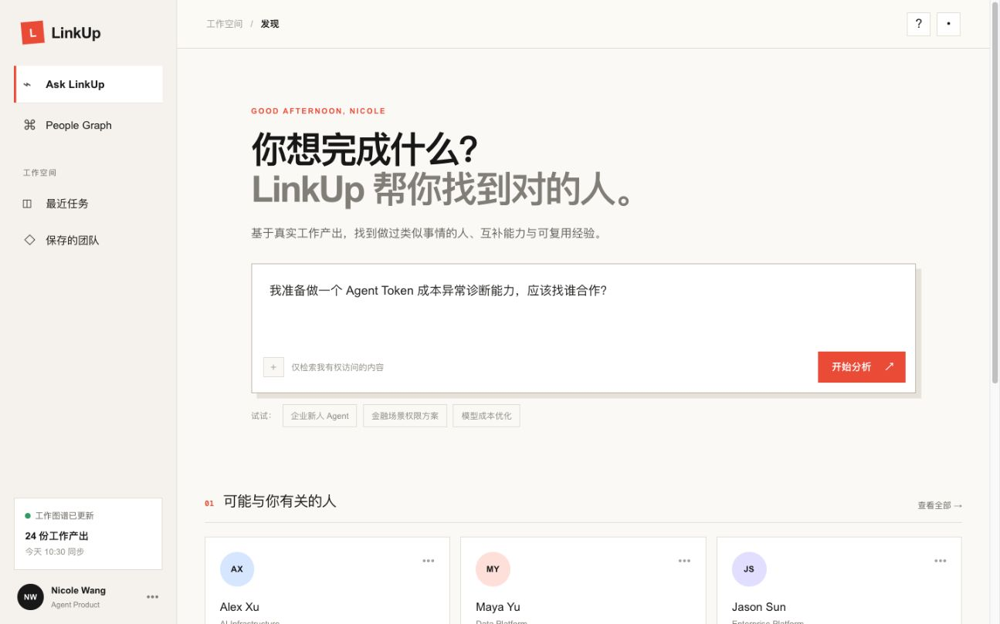
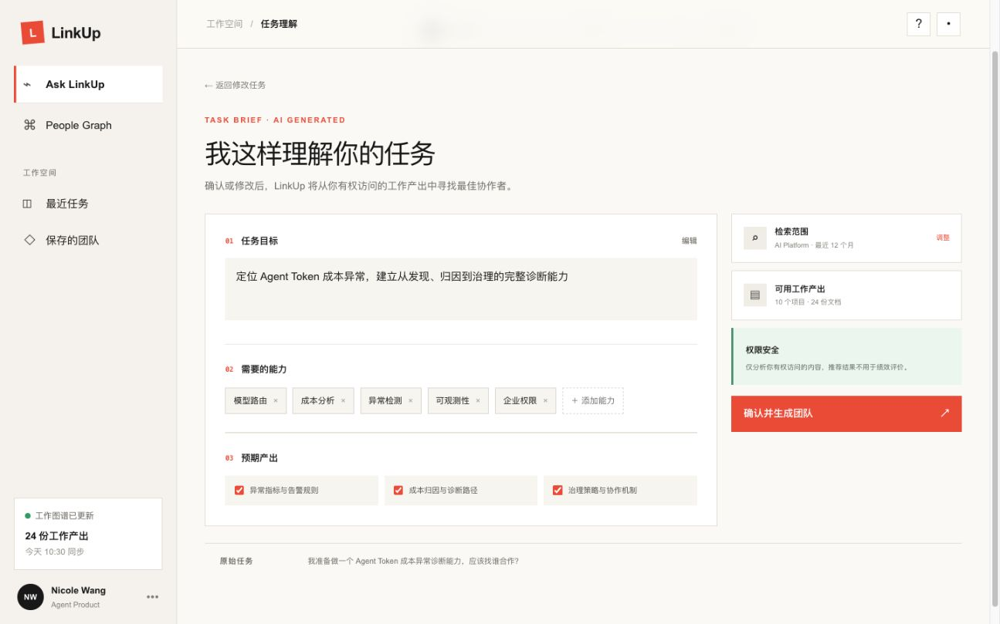
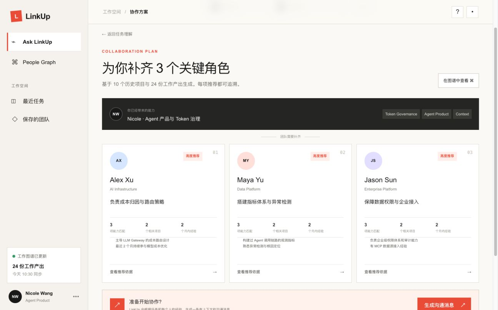
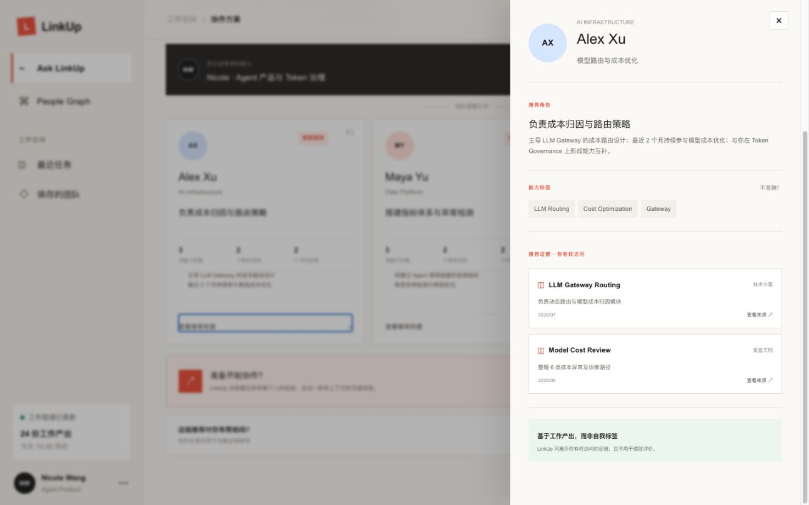
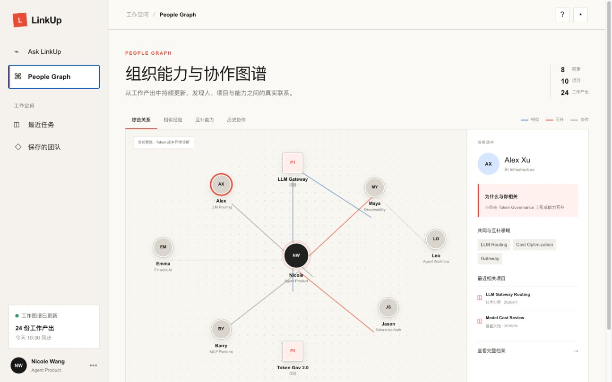
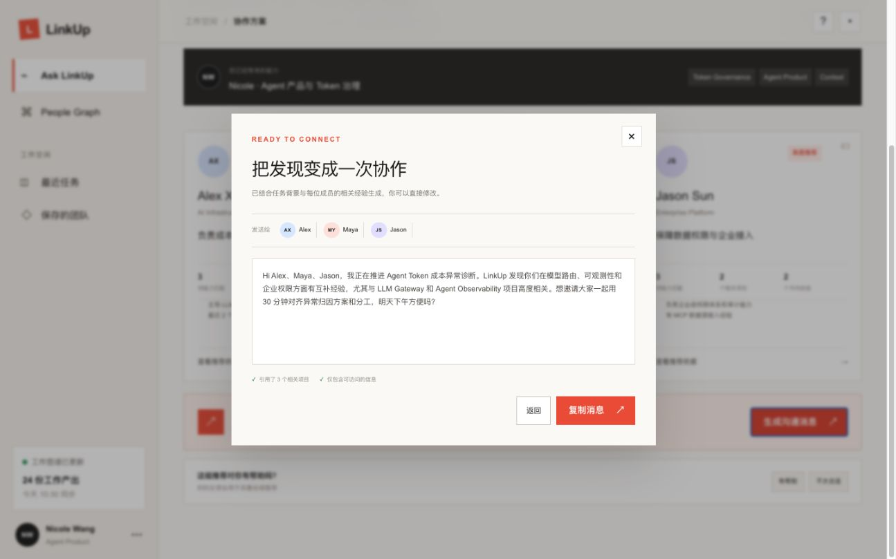

# LinkUp

> 基于真实工作产出，为新任务找到合适的人、互补能力与可复用经验。

LinkUp 是一个面向企业内部协作场景的高保真产品 Demo。它不回答“谁认识谁”，而是回答一个更具体的问题：

> 当我要推进一项新任务时，公司里谁做过类似的事情、谁能补齐我的能力，以及我们为什么适合一起协作？

系统从需求单、PRD、技术方案、项目文档、会议纪要、Issue 和复盘等工作产出中理解员工的真实经验，构建动态能力与协作图谱，并在新任务出现时生成可解释的团队建议。

## 核心体验

Demo 围绕“构建 Agent Token 成本异常诊断能力”展开，形成一条完整的黄金路径：

1. 用户描述准备推进的新任务。
2. Agent 将任务拆解为目标、所需能力、检索范围和预期产出。
3. 用户检查并修改 Agent 的任务理解。
4. 系统识别用户已经具备的能力和当前团队缺口。
5. LinkUp 推荐三位能力互补的协作者，并为每个人分配角色。
6. 每项推荐都能追溯到相关项目和工作文档。
7. 用户可以在 People Graph 中查看人物、项目和协作关系。
8. 系统根据任务上下文生成沟通消息，帮助用户发起协作。
9. 用户反馈推荐是否合适，形成后续优化闭环。

## 主要功能

### Ask LinkUp

- 输入自然语言任务
- 查看并编辑 Agent 的任务理解
- 识别当前用户已有能力与待补齐能力
- 生成角色化的协作团队
- 查看推荐理由、相关项目和文档证据
- 生成带有上下文的沟通消息
- 提交推荐反馈

### People Graph

- 独立探索组织中的人物和项目
- 查看相似经验、互补能力与历史协作关系
- 按关系类型筛选图谱
- 查看人物能力、相关项目和推荐依据
- 对不准确的 AI 能力推断进行反馈

## 设计原则

### 从任务出发，而不是从通讯录出发

LinkUp 的核心单位不是“员工排名”，而是“完成当前任务需要怎样的团队”。系统先理解任务和能力缺口，再寻找合适的人。

### 推荐必须可以解释

Demo 不展示缺乏依据的精确匹配分数。推荐使用能力匹配、相关项目、经验时效和协作关系等可理解信息，并允许用户查看原始证据。

### 强调能力互补

系统不仅寻找做过相似事情的人，也会识别当前用户已有能力，优先推荐能够补齐团队缺口的协作者。

### 企业数据需要可信边界

- 仅分析用户有权访问的内容
- 展示推荐结论的信息来源
- 允许员工纠正不准确的能力标签
- 明确不将能力图谱用于绩效评价

## Demo 截图

| 任务输入 | Agent 任务理解 |
| --- | --- |
|  |  |

| 团队推荐 | 推荐证据 |
| --- | --- |
|  |  |

| People Graph | 行动闭环 |
| --- | --- |
|  |  |

## 技术实现

- React 19
- TypeScript
- Vinext / Vite
- Tailwind CSS 4
- Cloudflare Workers 兼容构建

当前版本使用结构化模拟数据还原完整产品流程，不包含真实企业数据接入、在线模型调用、身份系统或消息发送能力。

## 本地运行

环境要求：Node.js 22.13 或更高版本、pnpm。

```bash
pnpm install
pnpm dev
```

启动后访问：

```text
http://localhost:3000
```

生成生产构建：

```bash
pnpm build
```

## 项目结构

```text
LinkUp/
├── app/
│   ├── globals.css       # 全局样式与页面视觉
│   ├── layout.tsx        # 页面元信息与根布局
│   └── page.tsx          # Demo 页面、假数据与交互状态
├── public/
│   ├── favicon.svg
│   └── og.png            # 社交分享预览图
├── screenshots/          # 六张作品提交截图
├── submission.md         # 校招作品提交文案
└── README.md
```

## 数据模型示意

Demo 中的推荐逻辑可以概括为：

```text
新任务
  ↓
提取任务目标与所需能力
  ↓
检索相关历史项目和工作产出
  ↓
根据项目贡献识别候选人
  ↓
排除当前用户已经覆盖的能力
  ↓
组合经验相关、能力互补的团队
  ↓
为每项推荐附上项目与文档证据
```

## Demo 范围

已经实现：

- 桌面端高保真界面
- 完整任务到团队的交互路径
- 可编辑的任务理解
- 团队推荐与证据详情
- 可筛选的 People Graph
- 沟通消息生成与推荐反馈

暂未实现：

- 企业数据源真实接入
- 在线 LLM 推理和推荐模型
- 用户身份与权限后台
- 真实消息发送
- 持久化数据存储
- 移动端适配

## 效果评估

后续验证将重点关注：

- 推荐采纳率：用户是否认可并选择推荐成员
- 联系转化率：用户是否向推荐成员发起沟通
- 协作成功率：推荐是否最终促成有效协作
- 推荐可信度：用户是否理解并相信推荐依据
- 能力标签准确率：员工对系统能力推断的认可程度

## 下一步计划

1. 邀请 5 位企业用户使用真实任务完成可用性测试。
2. 验证用户是否理解推荐逻辑、信任证据并愿意发起联系。
3. 接入经过脱敏的真实项目文档，验证能力抽取质量。
4. 建立推荐反馈数据集，迭代任务匹配与团队组合策略。
5. 探索飞书、Slack、Jira、Confluence 等企业工作入口。

## 说明

本项目当前为高保真验证型原型。页面中的人物、项目、文档和推荐结果均为半虚构演示数据，不代表任何真实员工评价或企业内部信息。
